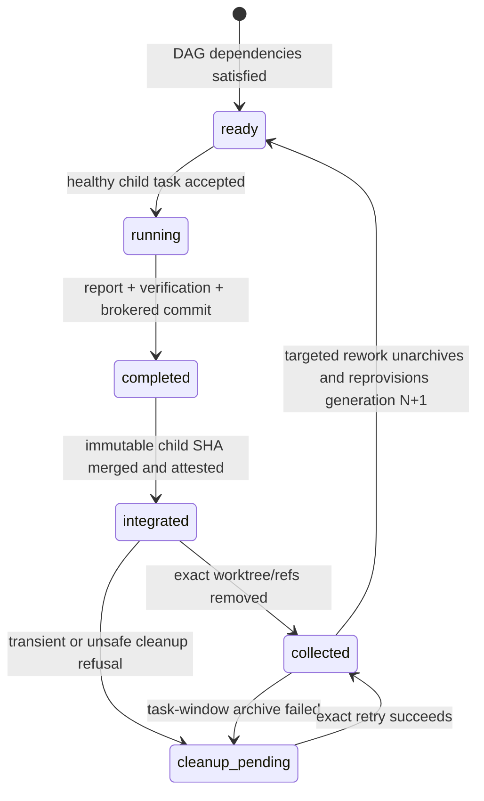
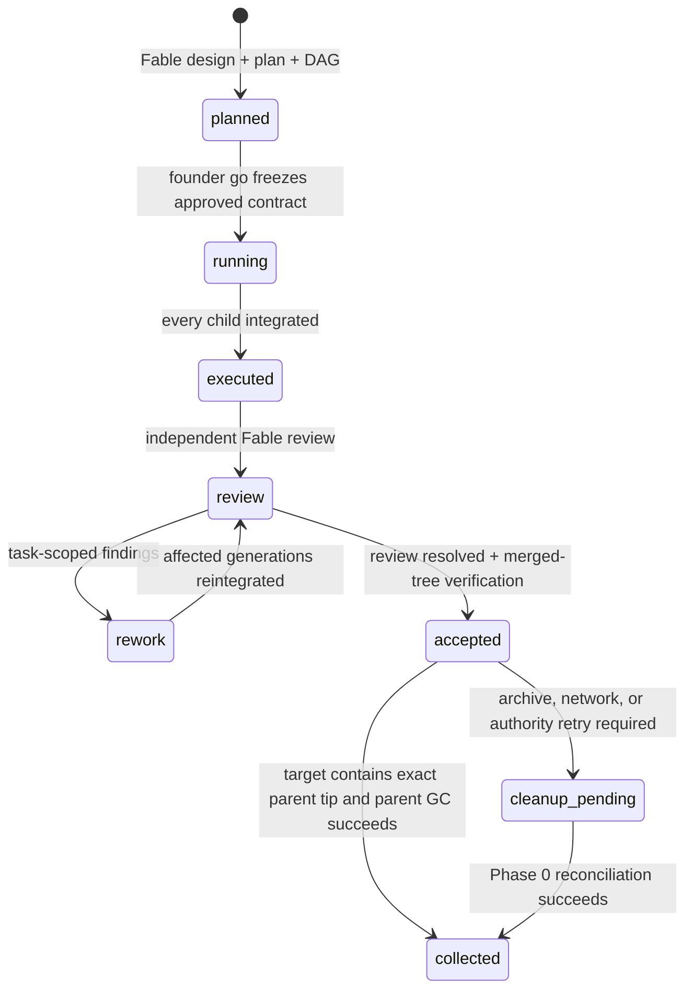

# Orchestrator

Mission-control orchestration for Codex and Claude Code. The Codex coordinator
turns an ask into a validated design and approved task DAG, provisions an
isolated Git worktree and Codex task for each ready DAG node, integrates only
attested child commits, runs independent final review, and safely collects both
child and parent resources. The Claude Code coordinator retains the staged
Hybrid 0.3 mission surface and fails closed when it recognizes a native 0.4
mission. Durable state lives in a repo-local `.orchestrator/`
hub so a fresh task can reconstruct every mission.

## Orchestrator 0.4 installation

Install both the execution workflow and the orchestrator:

```bash
codex plugin marketplace add DaoBrewAI/building-in-public --ref main
codex plugin add 10x-engineer@building-in-public
codex plugin add orchestrator@building-in-public
```

Start a new Codex task, open the umbrella folder that contains your repos, and
ask:

```text
Use $orchestrating to add retry logic to the cuff sync and update the endpoint schema.
```

Orchestrator 0.4.3 extends the Codex coordinator while preserving fixed backend
ownership across the Hybrid pipeline:

1. The Codex app task coordinates state, worktrees, mediation, acceptance, and
   merge.
2. A headless `claude-fable-5 --effort high` session brainstorms the request,
   writes the design and plan, and pauses at the founder `go` gate.
3. On the Codex coordinator surface, bounded App Server-backed project task
   windows run GPT-5.6-Sol child turns for dependency-ready DAG nodes in
   separate `workspace-write` worktrees and publish durable results.
4. The original Fable session resumes for independent code review. Findings
   return to the exact owning Codex child task as `rework`; Fable re-reviews
   afterward.

Native 0.4 child execution uses App Server-backed project task windows.

External planning defaults to `auto-least-scope`: Orchestrator gives one short
startup notice and continues immediately, sending only task-relevant source,
build/release configuration, and tests to Fable/Opus for read-only planning and
review. It excludes secrets, OAuth values, credentials, tokens, customer or
personal data, generated customer outputs, ignored/private corpora, and
unrelated files. Users can explicitly select `approval-required` for one
upfront pause or `no-external` to block the Hybrid backend before provisioning;
already-authorized least-scope inputs never trigger a mid-run consent prompt.
Invoking Orchestrator is the standing authorization for those least-scope
external stages across planning, review, re-review, authentication refresh, and
session resume. A new chat or missing repeated consent sentence cannot switch
the mission into approval-required mode. Only an explicit user setting or a
concrete host/tool approval denial may pause the external stage; the model may
not invent a security-approval gate.

Fable brainstorming is interactive through the Codex coordinator. Before
design.md, Fable checks for unanswered questions that could change scope,
user-visible behavior, architecture, or success criteria. When one exists, the
coordinator asks exactly one concise classification question with options and a
recommendation, then resumes the same Fable session. Explicitly approved
designs keep the direct-to-plan fast path. The completed design and plan still
pause at the existing founder go gate; downstream DAG, execution, review, and
GC behavior is unchanged.

Fable is read-only on every worktree. All implementation, test fixes, and
review-driven patches belong to GPT-5.6-Sol. Fable receives no Bash tool; the
coordinator supplies immutable diff snapshots for review. The Codex sandbox keeps linked
worktree Git metadata read-only, so the executor writes
`COMMIT-REQUEST-<n>.json`; `scripts/commit-broker.sh` validates each request and
creates the commit outside the sandbox without handing Codex broader access.
The broker trusts only `$HUB/control/<mission-slug>/worktrees.txt`, never the
worker-writable copy.

Mission hooks coexist with repository-owned Claude configuration. Shared,
Git-tracked project settings remain in `.claude/settings.json`; Orchestrator
installs guard and gate hooks in Claude's higher-precedence local project layer,
`.claude/settings.local.json`, and excludes that temporary file through the
worktree's Git metadata. Its SHA-256 is frozen in coordinator-owned control
state and verified before every Fable plan/review turn. Provisioning uses an
atomic no-clobber install and fails closed if local settings already exist, so
Orchestrator never overwrites a developer's private configuration.

The Hybrid launcher and state machine live in `scripts/` and `templates/` and
are shared by both coordinator surfaces. New native 0.4 missions use these
shared assets only through the Codex coordinator.
Model ownership, coordinator-only scheduling, immutable child integration, and
exact-authority cleanup are plugin invariants and are not configurable per
mission.

Requires `git`, `jq`, `uuidgen`, Python 3.9 or newer, the Claude CLI
authenticated for Fable-5, a Codex CLI with App Server support authenticated
for GPT-5.6-Sol, and the `10x-engineer` plugin on the Claude side. Start a new
Codex task after upgrading so the 0.4 skill text is loaded.

## Mission-internal task DAG and two-level GC

After the founder approves the plan, Orchestrator 0.4 freezes a validated
`approved-task-dag.json` beside the approved design, plan, and executor brief.
Only the coordinator computes the ready set. Every ready node gets one fresh
project-local Codex task, one `orc-task/<mission>/<task-id>` branch, one exact
manifest-recorded worktree, and one writable sandbox root. Children never
schedule or create other children.

Native child acceptance requires `list_threads` visibility. The coordinator
accepts a child task ID only after the exact ID appears with the intended
project/cwd context, expected title, first-turn status, startup evidence,
and available settings evidence pass a health check. `read_thread` is supporting
evidence, never a substitute for presence in the user-facing task list. An
invisible, unreadable, or stale provisional ID may be replaced once; a second
failure becomes `BLOCKED`. Native 0.4 never falls back to `codex exec`.
Completion is durable state on disk, not an inference from chat text or process
exit.



Integration merges the attested immutable child SHA with a normal merge commit;
it never consumes a mutable branch name or rewrites history. Child GC then
removes only the exact manifest-bound worktree and matching refs. The accepted
child task window is archived only after verified integration and resource
collection. Targeted rework unarchives that same task, advances its generation
from the updated parent tip, reintegrates it, recollects it, and rearchives the
same accepted task ID.



Parent GC runs as compensation at every Phase 0 before new scheduling. It
requires resolved final review, a clean exact parent worktree, every terminal
child task window archived, and independent proof that the recorded parent tip
is contained in the target branch. PR metadata is only additional evidence.
Before removing the exact parent worktree and refs, it archives design, plan,
approved DAG, decisions, report, verification, and cleanup journal.

### Failure and retry behavior

| Condition | Result | Retry boundary |
|---|---|---|
| Dirty child or parent worktree | Preserve worktree and refs; refuse integration or GC | Clean or resolve through the owning Codex task, then retry exact authority |
| Completed but unmerged child, or parent tip absent from target | Preserve resources; no inferred completion | Integrate or merge, refresh attestation, then reconcile |
| Duplicate owner or stale provisional child task ID | Reject ownership; allow at most one health-checked replacement | Same frozen brief and ready-set epoch |
| Remote/network check failure | Record `cleanup_pending`; do not partially delete | Next Phase 0 with the same manifest and SHA leases |
| Child task-window archive failure | Retain exact accepted ID and archive-pending marker | Retry the task API, then rerun compensating GC |
| Task-targeted rework | Unarchive the same task, reprovision generation N+1, reintegrate, recollect, rearchive | Same accepted task ID and retained sandbox authority |
| Repeated integration or cleanup | Verified idempotent no-op | Safe to repeat after ambiguous interruption |

### Migration from the single executor

- New 0.4 missions require the frozen task DAG and coordinator-owned task
  registry; before provisioning they record a coordinator-owned
  `pipeline-version` authority containing `0.4.0`. They run bounded child Codex
  tasks instead of one whole-plan Codex executor.
- An in-flight 0.3 mission without a task registry is not split or silently
  migrated. The coordinator recognizes the shared Hybrid mission/session shape,
  recorded `codex_thread_id`, and simultaneous absence of both frozen DAG and
  task registry, then resumes its recorded single Codex executor through the
  shared launcher until that mission finishes. Partial or contradictory
  authority fails closed instead of guessing a version.
- Existing child or parent resources are never adopted by naming pattern. A
  0.4 retry requires the exact retained paths, repo, branch, SHA, generation,
  accepted task ID, and sandbox authority.
- Claude's existing 65% `Stop` hook remains unchanged. Codex continuation uses
  supported `PreCompact` and compact `SessionStart` events; it does not claim a
  context percentage or parse unstable transcript contents.
- The `codex-scripts/`, `codex-templates/`, and `codex-tests/` trees remain the
  unchanged Codex 0.2 compatibility surface described below.

### Legacy Codex 0.2 compatibility

The `codex-scripts/`, `codex-templates/`, and `codex-tests/` trees remain for
missions already created by the 0.2 single-Codex pipeline. The 0.4 coordinator
detects those missions by their legacy mission/template shape as well as their
session shape, including pending missions with no session yet, and resumes them
with the legacy launcher. It never silently switches an in-flight mission
between state machines. New Codex-coordinated missions use the Hybrid 0.4 shared assets.

## Claude Code installation

The Claude Code edition lives in `.claude-plugin/`, `claude-skills/`,
`commands/`, `hooks/`, `scripts/`, `templates/`, and `tests/`.

```text
/plugin marketplace add DaoBrewAI/building-in-public
/plugin install 10x-engineer
/plugin install orchestrator
```

Use `/orchestrator:orchestrate <ask>` or your local `/orchestrate` alias.
Requires `git`, `jq`, `uuidgen`, the Codex CLI (`codex` on PATH or the
ChatGPT.app bundled binary; `ORC_CODEX_BIN` overrides), and the `10x-engineer`
plugin.

Hybrid 0.3 compatibility continues to use `codex exec`: a headless `claude -p`
session plans and pauses at a founder go-gate (`planned`), the recorded single
executor runs and verifies inside a `workspace-write` sandbox, then the same
Claude session resumes for code review. New native 0.4 task-DAG missions instead
use visible App Server-backed child task windows. Hardening from the first live
mission retrospective (22 BLOCKEDs, 19 eliminable):

Native 0.4 task-DAG execution is Codex-coordinator-only. Before reconciling a
hub, the Claude coordinator classifies each mission. The Claude coordinator
recognizes native 0.4 authority, makes no mission mutation, and hands it back to
Codex; partial or contradictory version authority also fails closed. Existing
Hybrid 0.3 missions continue through the single recorded Codex executor. To
close the pre-plan crash window, new Claude-coordinated 0.3 missions publish an
explicit `0.3.0` pipeline marker before provisioning; older unmarked 0.3
missions remain recognizable only from their recorded Hybrid stage history.

- **Commit broker** (`scripts/commit-broker.sh`) — the Codex sandbox keeps git
  metadata read-only, so the executor writes `COMMIT-REQUEST-<n>.json` and
  polls in-turn for `COMMIT-DONE-<n>.json` instead of a BLOCKED round-trip per
  task; the broker validates the path manifest before committing.
- **Provision preflight** (`scripts/provision-preflight.sh`) — installs
  dependencies, pre-creates in-worktree Swift caches, and runs the full
  baseline **outside the sandbox** into `baseline-attestation.json`; briefs
  carry a sandbox-facts section and an accepted-failure-set rule so sandbox
  noise is never mistaken for a regression.
- **Quota-limit detection** — `spawn-worker.sh` recognizes session/usage-limit
  kills, exits 75 with a `retry_after` hint, and the coordinator schedules a
  delayed respawn instead of counting a crash strike.
- **Tighter pipeline gate** — a turn that ends with mission state still
  `running` is bounced back until the session records
  planned/executed/blocked/review.
- **Planner hardening** — reuse claims require `file:line` citations from real
  code, contract-changing tasks annotate their compile-impact surface, and
  every checkpoint must compile independently.
- **`scripts/orchestrator-gc.sh`** — state-gated cleanup for completed mission
  worktrees plus local and remote `orc/` branches; Phase 6 invokes it with
  `--clean` automatically after a successful merge.

## Mission lifecycle

1. **Record and provision** — preserve the original ask, create one guarded
   `orc/<mission-slug>` worktree per repo, and render both backend briefs.
2. **Fable brainstorm + plan** — the same Fable session creates design.md,
   plan.md, and plan-review.html, then enters `planned`.
3. **Founder go** — review design decisions and approve the implementation
   plan. The Codex coordinator freezes design, plan, task DAG, and executor
   brief for native 0.4; the Claude coordinator preserves the in-flight 0.3
   three-file contract.
4. **Codex execute** — on the native 0.4 Codex coordinator surface, bounded
   GPT-5.6-Sol child tasks implement ready DAG nodes with TDD, verification, and
   brokered commit checkpoints; after exact integration they enter `executed`.
   An in-flight Claude-coordinated 0.3 mission resumes its single recorded
   Codex executor instead.
5. **Fable review** — resume the original Fable session. Native 0.4 findings
   return to the exact owning child task; in-flight 0.3 findings return to its
   single recorded executor.
6. **Accept and clean up** — verify frozen artifacts, diff scope, Fable verdict,
   and Codex test evidence; commit only a verified merge, remove mission
   policy/worktrees, and archive state.

Missions sharing a repo run in parallel by default — isolation is per-worktree,
not per-repo, since each mission owns its own worktree and `orc/<mission-slug>`
branch. A mission is held `pending` only when it would reuse another mission's
worktree or branch, or when it genuinely depends on another's output (builds on
unmerged commits, collides on the same files at merge, or shares a contract or
migration chain). It then launches automatically once the blocker is accepted or
failed.

## Decision host tag

Store this machine's fixed decision tag as a single line in
`~/.config/daobrew/orchestrator-host-tag`. The file is machine-local and
deliberately lives outside the hub, so it is never committed or pushed. If it
is missing or empty, Orchestrator falls back to deriving a tag from `hostname`.

## Hub layout

```text
.orchestrator/
├── missions/<date>-<slug>/
│   ├── MISSION.md
│   ├── request.md
│   ├── design.md
│   ├── brief.md
│   ├── brief-exec.md
│   ├── state
│   ├── worktrees.txt
│   ├── session.txt
│   ├── commits.txt
│   ├── plan.md
│   ├── plan-review.html
│   ├── BLOCKED-n.md / ANSWER-n.md
│   ├── report.md
│   └── worker-output-* + worker-stderr.log
├── control/<date>-<slug>/
│   ├── worktrees.txt
│   ├── approved-design.md
│   ├── approved-plan.md
│   ├── approved-task-dag.json
│   ├── brief-exec.md
│   ├── approved.sha256
│   ├── worker-settings.sha256
│   ├── parent-cleanup-manifest.txt + parent-cleanup-state
│   ├── tasks/<task-id>/
│   │   ├── worktrees.txt + generation + state
│   │   ├── accepted-thread-id + task-window-state
│   │   └── integration/cleanup/reprovision receipts and journals
│   ├── continuations/ + coordinators/
│   └── review-diff-*.patch
├── DECISIONS.md
├── MEMORY.md
├── board.html
└── archive/
```

`state` is one of `pending`, `running`, `planned`, `executed`, `rework`,
`blocked`, `review`, `accepted`, or `failed`. A dead process never implies lost
work: the coordinator inspects the last recorded stage, both session IDs,
branches, artifacts, and output before resuming or respawning.

## Guards

Hybrid 0.4 uses five layers:

1. Claude receives no Bash tool; hooks restrict Write/Edit to mission artifacts,
   making brainstorm/plan/review read-only on every worktree.
2. Codex OS sandbox roots restrict executor writes to mission workspaces and the
   mission directory.
3. The go gate freezes the approved contract and worktree manifest outside all
   worker-writable roots; the broker and executor use only that authority.
4. The pipeline gate requires design/plan/review/verification artifacts, while
   the commit broker validates executor commit requests outside the sandbox.
5. Coordinator acceptance verifies artifact and diff scope; any verification
   that may write is routed to the exact Codex child that owns it.

The OS sandbox, trusted wrapper, and acceptance checks are the enforcement
boundaries. The launcher never bypasses the Codex sandbox or hook trust.

## Dual-host layout

| Path | Host |
|---|---|
| `.codex-plugin/`, `skills/` | Codex coordinator surface |
| `.claude-plugin/`, `claude-skills/`, `commands/`, `hooks/` | Claude coordinator surface |
| `scripts/`, `templates/`, `tests/` | Shared Hybrid 0.4 pipeline |
| `codex-scripts/`, `codex-templates/`, `codex-tests/` | Legacy Codex 0.2 compatibility |

The Codex coordinator reconstructs native 0.4 task-DAG state. The Claude
coordinator recognizes native 0.4 authority before mutation and hands the
mission back to Codex; it does not schedule or resume 0.4 children. Both
surfaces preserve the staged Hybrid 0.3 compatibility path. Each stage must
still be resumed by its recorded backend: brainstorm/plan/review on the Claude
session ID; native 0.4 execution/rework on each owning task's exact accepted
Codex child ID; and in-flight 0.3 execution/rework on its single recorded
`codex_thread_id`.
